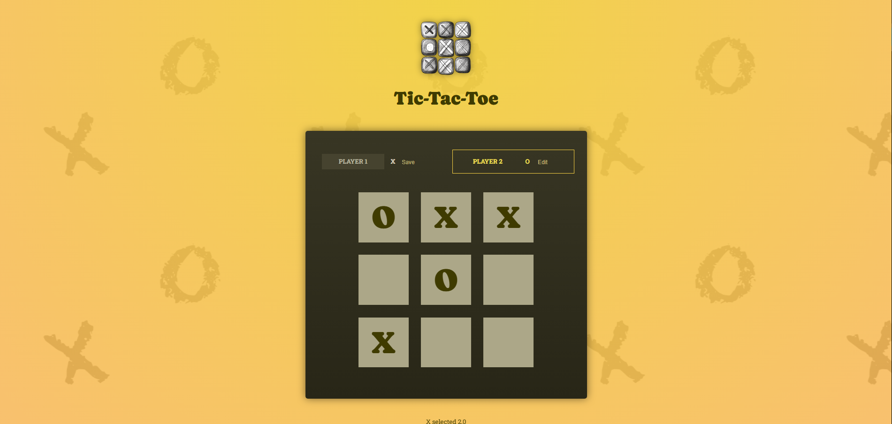
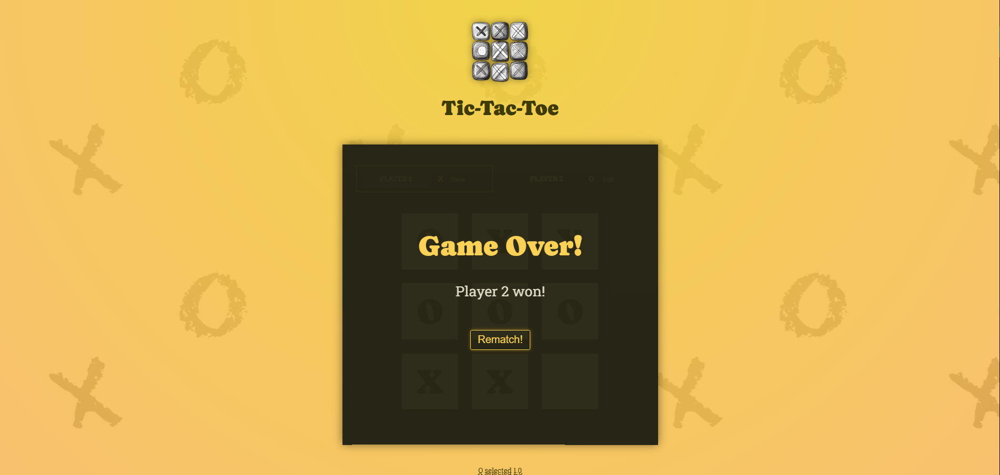

# **❌⭕ Tic-Tac-Toe Game*

**Tic Tac Toe** to klasyczna gra "Kółko i Krzyżyk" stworzona w React, umożliwiająca rozgrywkę dla dwóch graczy.

**Screnshots**




## **📌 Funkcjonalności**
* **Edytowanie nicków graczy** każdy gracz może dowolnie zmienić i zapisać swój nick.
* **Wyświetlanie ruchów** poniżej planszy wyświetlają się poprzednie wykonane ruchy.
* **Wynik** gra kończy się zwycięstwem lub remisem z możliwością restartu.

## **🛠 Technologie**
* **React** – biblioteka do budowy interfejsu użytkownika.
* **CSS** – stylowanie aplikacji.
* **JavaScript (ES6+)** – logika aplikacji


## **🚀 Uruchomienie**
1. **Zainstaluj zależności**:
   ```sh
   npm install

2. **Uruchom aplikację**
   ```sh
   npm start
3. **Otwórz w przeglądarce**:
Wyswietlony: htttp://localhost:{PORT}